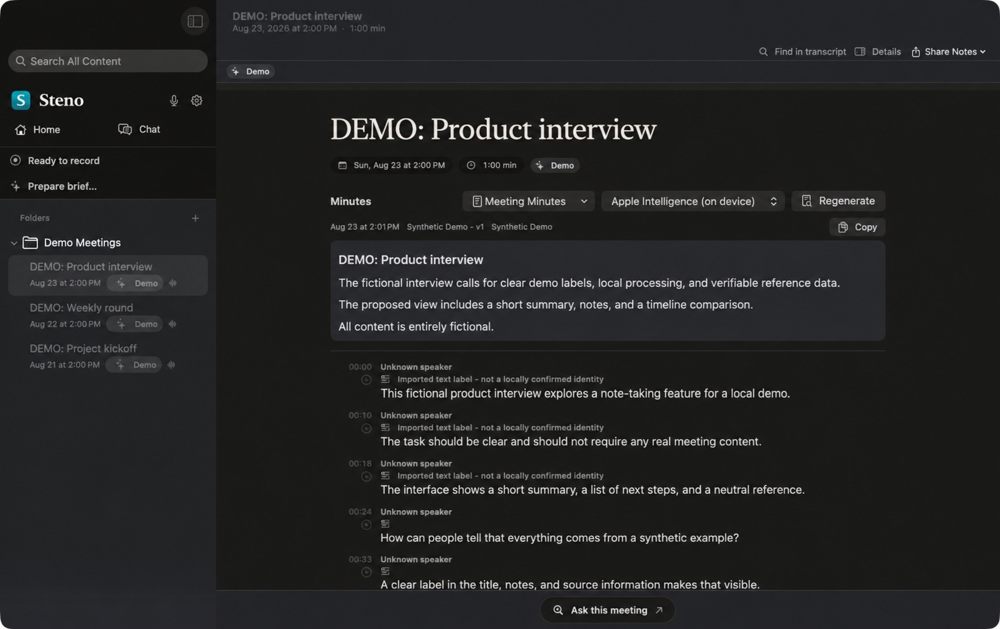

<div align="center">
  
  <h1>Steno</h1>
  <p><strong>Record locally. Review transcripts. Turn meetings into useful notes.</strong></p>
  <p>Record, transcribe, separate speakers, review, and create meeting minutes on Mac, iPhone, and iPad.</p>
</div>

<p align="center">
  
  
  
  
</p>

Steno is a native SwiftUI meeting recorder for Apple platforms.
Recording, transcription, speaker separation, and the default meeting reports run on the device.
External text models are optional and configured explicitly. Reports, library chat, and meeting briefs can use the selected endpoint after showing what will be sent.

This repository contains both apps and their shared core.
It is the native Swift successor to [Steno Legacy](https://github.com/stenolabs/stenoai), not a port of its Electron interface.

> [!WARNING]
> Steno is pre-release software.
> Do not use it as the only copy of an important recording, and verify your local recording and consent requirements before recording other people.

<p align="center">
  
</p>

<p align="center"><em>Steno for macOS with synthetic demo content translated into English for this screenshot. No real meeting data is shown.</em></p>

## What Steno can do

- Record microphone audio on macOS, iPhone, and iPad.
- Record microphone and system audio as separate original tracks on macOS.
- Show a live transcript and create a final transcript with word timestamps.
- Separate speakers locally and let a human confirm identities, assign multiple clusters to one person, mark mixed clusters, or leave them generic.
- Preserve transcript edits and retranscriptions as revisions, and keep regenerated reports as separate immutable versions.
- Create meeting minutes on-device with Apple Intelligence when it is available.
- Use an explicitly configured Ollama, LM Studio, OpenAI, Anthropic, Amazon Bedrock, or OpenAI-compatible endpoint for an individual report.
- Organize meetings in folders, search meeting content, review people, and keep personal notes.
- Ask questions across selected meetings using their reports and notes, or prepare a brief from earlier reports.
- Export Markdown, PDF, and unchanged original audio tracks on macOS, or combine microphone and system audio into a stereo M4A.
- Mirror meeting notes to an Obsidian vault on macOS after approving the destination.
- Transfer a portable snapshot of one meeting between devices as a `.stenomeeting` package, with optional compressed audio.
- Enable the optional library-encryption beta on macOS with a recovery code and a retained pre-switch backup.
- Install a clearly marked synthetic demo library for screenshots and repeatable tests.

## Platform support

| Capability | macOS | iPhone and iPad |
|---|---:|---:|
| Microphone recording | Yes | Yes |
| System audio recording | Yes | No |
| Background recording | App sleep prevention | Background audio session |
| Live and final transcription | On-device | On-device, physical device required |
| Local speaker diarization and review | Yes | Yes |
| On-device meeting minutes | Apple Intelligence when available | Apple Intelligence when available |
| Optional external text models | Yes | Yes |
| Library chat and meeting briefs | Yes | Yes |
| Single-meeting snapshot | Import and export | Import and export |
| Optional library encryption | Beta | Not available |

The current deployment targets are macOS 26, iOS 26, and iPadOS 26.
The project deliberately supports ARM64 and Apple Silicon only.

## Privacy model

Local processing is the default.

| Data | Default behavior |
|---|---|
| Audio recordings | Stay on the device and are never sent to a text model or automatic cloud sync. Audio is included in a meeting transfer only when the user enables it for that export. |
| Speech transcription and speaker diarization | Run on the device. Model downloads may contact Apple or the documented model host, but do not contain meeting content. |
| On-device reports | Use Apple Intelligence when it is available. |
| External reports | Send the transcript, confirmed speaker names, participant names and companies, and meeting notes only when the user generates a report with an external endpoint. The selected endpoint can remain selected for later reports, and the disclosure is shown before each generation. Audio is never included. |
| External chat and briefs | Library chat uses reports and notes from the chosen scope; briefs use earlier reports. Using an external endpoint sends that context and the request to the selected provider after confirming the external-send disclosure. That consent can remain valid for later requests in the same session. |
| API keys | Stored in the Keychain and kept out of the endpoint registry, jobs, and logs. |
| Telemetry | None. |

External providers never receive the Steno library itself.
They receive the context assembled for the requested report, chat, or brief. Generated reports record their provider.

Meeting transfer packages are unencrypted files passed to the system share sheet.
The share sheet can send them through more than AirDrop, so inspect the destination before sharing.
A package contains the meeting title and date, notes, one current transcript snapshot with visible speaker labels, and only the audio tracks selected for that export. Compressed transfer audio is a derived copy; the source recordings remain unchanged.
It does not contain reports, folders, the people library, voice evidence, processing runs, or transcript revision history, so it is not a full backup.

### Storage caveat

Libraries are unencrypted by default.
On macOS, the optional **Library Encryption (Beta)** setting prepares and verifies an encrypted copy before switching. Keep the recovery code safe. The previous unencrypted library remains as a backup until explicitly removed.
The default macOS location is `~/Library/Application Support/Steno/Library`; a custom location can be selected in Settings.
On iPhone and iPad it lives in `Documents/StenoLibrary`, is visible in the Files app, and is excluded from iCloud backup while it remains unencrypted.
There is no automatic library sync or cloud backup yet.
Steno does not yet provide a verified full-library backup and restore workflow.
Keep a deliberate backup of important meetings.

## Try it without real meeting data

Open **Demo Data** in Steno and choose **Install demo meetings**.
Steno adds three clearly marked fictional German meetings with synthetic audio, transcripts, speaker turns, notes, and reports.
Installation uses no network connection and downloads no model.

The demo library is designed for screenshots, UI exploration, and repeatable benchmarks.
It is isolated from real voice profiles and can be removed again from the same screen.
Full generation and license attribution is stored with the dataset in [`StenoKit/Sources/StenoDemo/Resources/DemoDataset/ATTRIBUTION.md`](StenoKit/Sources/StenoDemo/Resources/DemoDataset/ATTRIBUTION.md).

## Build from source

Signed public downloads are not available yet.
The current beta is built from source.

### Requirements

- An Apple Silicon Mac running macOS 26.
- Xcode 27, verified for the current macOS build (the Swift packages require Swift 6.3).
- [XcodeGen](https://github.com/yonaskolb/XcodeGen).
- An Apple development team for physical-device installation and stable local signing.

Clone the repository:

```bash
git clone https://github.com/stenolabs/steno-swift.git
cd steno-swift
```

For stable local signing, copy the ignored configuration template, insert your Apple team ID, and choose a bundle identifier registered to that team:

```bash
cp .steno-signing.xcconfig.example .steno-signing.xcconfig
```

```xcconfig
DEVELOPMENT_TEAM = YOUR_TEAM_ID
STENO_BUNDLE_IDENTIFIER = com.example.Steno
```

The local file is ignored by Git and must not be committed.

### macOS

Build and launch the app:

```bash
scripts/build-app.sh --run
```

The build product is written to `.build/DerivedData/Build/Products/Debug/steno-macos.app`.

### iPhone and iPad

Build and launch in a booted iPhone simulator:

```bash
scripts/build-ios.sh --simulator
```

Build and launch in an iPad simulator:

```bash
scripts/build-ios.sh --ipad-simulator
```

Install on the first available paired iPhone or iPad:

```bash
scripts/build-ios.sh --device
```

The simulator can exercise the interface and the bundled demo library, but Apple's `SpeechTranscriber` does not expose supported languages there.
Use a physical device to test live speech, language availability, and model installation.

## First run

1. Choose the language that will actually be spoken in the meeting.
   Steno deliberately does not infer it from the system locale.
2. Grant microphone access.
3. On macOS, grant system audio access if you want to capture the other side of calls.
4. Review the model source and download size before installing optional transcription or diarization models.
5. Record a short disposable meeting and verify playback before relying on the beta for longer sessions.

## How processing works

1. Steno writes each available input as a separate original audio track.
2. Live transcription runs independently from recording, so a missing model or transcription failure cannot stop capture.
3. Stopping a recording queues final transcription, diarization, and speaker matching as recoverable jobs.
4. The review screen lets a person confirm speaker identities instead of guessing names.
5. Corrections and retranscription create transcript revisions, while regenerated reports create separate immutable report versions.

Original audio is the irreplaceable artifact in this architecture.
Completed originals are never overwritten, and failed processing keeps the last valid transcript or report visible.

## Models

| Role | Options | Notes |
|---|---|---|
| Live and final transcription | Apple Speech Analyzer | Production default. Language availability comes from the operating system on the current device. |
| Live and final transcription | FluidAudio Parakeet TDT | Optional. Final transcription is available for supported languages; live use is explicitly marked experimental. |
| Speaker diarization | FluidAudio Sortformer and WeSpeaker | Runs locally. The current diarizer supports at most four speaker slots per audio track. |
| Meeting minutes | Apple Intelligence (`SystemLanguageModel.default`) | On-device default when the system model is available. Apple selects the system model; Steno records its reported variant with each generated report. |
| Optional text models | Ollama, LM Studio, OpenAI, Anthropic, Amazon Bedrock, and OpenAI-compatible servers | Configured explicitly. Each report records the selected provider and endpoint revision. |

Models are installed only after explicit consent.
Providers do not download their own models silently.

## Known beta limitations

- There is no signed, notarized release, automatic updater, or public release channel yet.
- Library encryption is a macOS-only beta; see [Storage caveat](#storage-caveat) for backup and recovery limits.
- iPhone and iPad cannot capture system audio from other apps.
- The current diarizer is limited to four speaker slots per audio track.
- Guaranteed completion of long iOS post-processing in every background condition is still open work.
- Apple speech and Apple Intelligence availability varies by device, language, downloaded assets, and system configuration.
- The simulator cannot validate real speech-model availability.
- Intel Macs and Windows are not supported.

## Coming from Steno Legacy

The macOS app can import a Steno Legacy library without modifying the old installation.
Imported meetings, transcripts, reports, notes, folders, people, and voice evidence are copied into the new versioned library with duplicate protection.
Keep the legacy library until you have inspected the imported result and made an independent backup.

Feature coverage and deliberate differences are tracked in [`docs/FEATURE-PARITY.md`](docs/FEATURE-PARITY.md).

## Development

Both Xcode projects are generated from `project.yml` files and are intentionally not versioned.
Run XcodeGen after switching branches, merging, or rebasing.
The Swift packages require Swift tools 6.3, while the application targets compile in Swift 6 language mode.

There are four test suites:

```bash
swift test --package-path StenoKit

xcodegen generate
xcodebuild -project Steno.xcodeproj -scheme Steno \
  -destination 'platform=macOS' test

cd iOS
xcodegen generate
xcodebuild -project StenoiOS.xcodeproj -scheme Steno \
  -destination 'platform=iOS Simulator,name=iPhone 17' \
  -derivedDataPath build/DerivedData test

cd StenoiOSKit
xcodebuild -scheme StenoiOSKit \
  -destination 'platform=iOS Simulator,name=iPhone 17' test
```

The helper scripts always regenerate the corresponding Xcode project before building.

## Repository layout

| Path | Purpose |
|---|---|
| `StenoKit/` | Shared Swift package for domain types, storage, recording, transcription, diarization, identity, reports, transfer, demo data, and the processing pipeline. |
| `App/` | Native macOS application. |
| `iOS/App/` | Native iPhone and iPad application. |
| `iOS/StenoiOSKit/` | iOS-specific audio-session and microphone-capture package. |
| `Shared/` | UI resources and presentation helpers shared by both apps. |
| [`docs/`](docs/README.md) | Architecture, decisions, measurement records, fixtures, and current limitations. |
| `scripts/` | Build, test, benchmark, and reproducible demo-generation tools. |

The architectural invariants and failure behavior are documented in [`ARCHITECTURE.md`](ARCHITECTURE.md).

## Contributing

Bug reports, focused fixes, tests, and documentation improvements are welcome.
Read [`CONTRIBUTING.md`](CONTRIBUTING.md), the [`CODE_OF_CONDUCT.md`](CODE_OF_CONDUCT.md), and [`SUPPORT.md`](SUPPORT.md) before opening an issue or pull request.

## Reporting issues

Bug reports should include the device, OS version, app commit, reproduction steps, and whether the issue affects recording or only post-processing.
Do not attach real recordings, transcripts, participant details, endpoint credentials, or other meeting data to a public issue.
A synthetic demo meeting or a minimal generated fixture is preferred.

Report suspected security vulnerabilities privately by following [`SECURITY.md`](SECURITY.md).

## License

Steno is available under the [MIT License](LICENSE).
The bundled demo dataset carries its own attribution and licensing notes in [`ATTRIBUTION.md`](StenoKit/Sources/StenoDemo/Resources/DemoDataset/ATTRIBUTION.md).
Additional dependency and fixture notices are collected in [`THIRD_PARTY_NOTICES.md`](THIRD_PARTY_NOTICES.md).

Project roles and decision-making are described in [`GOVERNANCE.md`](GOVERNANCE.md) and [`MAINTAINERS.md`](MAINTAINERS.md).
